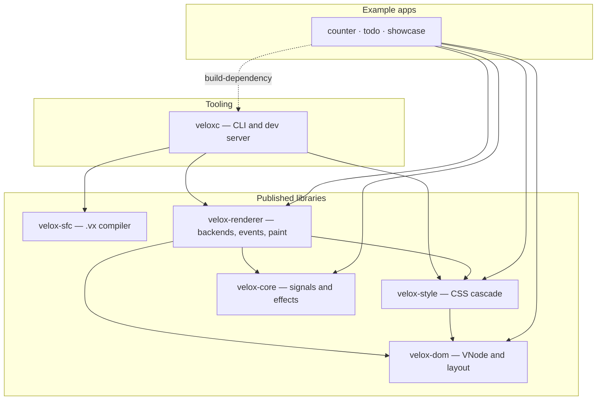

<div align="center">


# Velox

### A modern UI framework for Rust

**Reactive signals · Single-file components · Flexbox layout · Skia rendering**

<br>

[](https://crates.io/crates/veloxc)
[](https://crates.io/crates/veloxc)
[](LICENSE)
[](https://docs.rs/velox-core)

<br>

[Quick start](#quick-start) · [CLI reference](#cli-reference) · [Architecture](#architecture) · [Template syntax](#template-syntax) · [Feature status](#feature-status) · [Guides](#guides-and-documentation)

</div>

---

## Quick start

### Prerequisites

| Requirement | Why | Check |
|:---|:---|:---|
| **Rust 1.85+** | the workspace crates use edition 2024 | `rustc --version` |
| **Git** | scaffolds fall back to git dependencies | `git --version` |
| **C toolchain** | linker and build tools for native dependencies | see below |

<details>
<summary>Platform-specific build tools</summary>

```bash
# Linux (Debian/Ubuntu)
sudo apt-get install build-essential pkg-config libssl-dev

# macOS
xcode-select --install

# Windows
# Microsoft Visual C++ Build Tools: https://visualstudio.microsoft.com/visual-cpp-build-tools/
```

</details>

### Install

```bash
cargo install veloxc
```

That puts a single binary, **`veloxc`**, on your `PATH`. Every command on this
page is `veloxc <subcommand>` — `veloxc --help` lists them, and
`veloxc <subcommand> --help` is the authoritative flag reference.

```bash
veloxc version        # prints the CLI version and your platform
```

> [!TIP]
> Working from a checkout? Install the `main` branch directly instead of waiting
> for a crates.io release:
>
> ```bash
> cargo install --path veloxc --force
> ```

### Your first project

```bash
# 1. Scaffold
veloxc init my-first-app
cd my-first-app

# 2. Watch, build, run — reload with `r`, quit with `q`
veloxc dev

# 3. One-shot build
veloxc build
veloxc build --release

# 4. Build and launch once
veloxc run
```

A quick `veloxc lint src/App.vx` checks the generated component before you edit
anything.

<sub>Commands run from the **current working directory**, not from the Velox
source tree.</sub>

> [!IMPORTANT]
> **Where the scaffold points at Velox.** `veloxc init` wires your `Cargo.toml`
> to the workspace crates in one of three ways:
>
> | How you got the CLI | Dependencies written into your project |
> |:---|:---|
> | `cargo install --path veloxc` (from a clone) | relative `path = …` entries into that clone |
> | `veloxc init --local <path>` | the same, pinned to the checkout you name |
> | `cargo install veloxc` (crates.io) | `git = "https://github.com/fahimaloy/velox"` pinned to the commit the binary was built from |
>
> The crates.io binary is built outside a repository, so that pin falls back to
> `rev = "unknown"` and Cargo fails with ``revspec 'unknown' not found``. Until
> the fallback is fixed, either scaffold from a clone
> (`git clone https://github.com/fahimaloy/velox && cargo install --path veloxc`),
> pass `--local <path>`, or open the generated `Cargo.toml` and drop the
> `git = …` / `rev = …` keys from every `velox-*` line, leaving `version = …`
> — all six crates are published on crates.io.

### What `veloxc init` generates

```
my-first-app/
├── Cargo.toml            dependencies wired to Velox
├── build.rs              compiles .vx files during `cargo build`
├── README.md
├── assets/
│   ├── velox-logo.svg
│   └── velox-logo.png
└── src/
    ├── App.vx            entry component
    ├── main.rs           Rust entry point
    └── components/
        ├── Confirm.vx
        ├── Modal.vx
        ├── TodoInput.vx
        ├── TodoItem.vx
        └── Todos.vx
```

---

## CLI reference

Every subcommand `veloxc` exposes. Flags below are transcribed from
`veloxc <command> --help`; nothing here is inferred.

| Command | What it does |
|:---|:---|
| [`veloxc init`](#veloxc-init) | Scaffold a new project |
| [`veloxc build`](#veloxc-build) | Build the project, or compile one `.vx` file to Rust |
| [`veloxc run`](#veloxc-run) | Build and run once |
| [`veloxc dev`](#veloxc-dev) | Watch, rebuild, restart |
| [`veloxc lint`](#veloxc-lint) | Check `.vx` files |
| [`veloxc add component`](#veloxc-add-component) | Generate a component scaffold |
| [`veloxc version`](#veloxc-version) | Version and platform info |

### `veloxc init`

```
veloxc init <name> [options]
```

| Flag | Default | Description |
|:---|:---|:---|
| `-t, --template <name>` | `default` | Template variant |
| `--local <path>` | — | Wire the scaffold to a local Velox checkout |

`<name>` is a package name or a path — `myapp`, `/tmp/myapp`,
`../projects/myapp`. Dots and whitespace normalize to `-`; the name must start
with a letter or `_`.

```bash
veloxc init myapp                   # in the current directory
veloxc init /tmp/myapp              # absolute path
veloxc init ../projects/myapp       # relative path
```

### `veloxc build`

```
veloxc build [--release]              # the current project
veloxc build <file.vx> [-o <dir>]     # one component tree
```

| Flag | Applies to | Effect |
|:---|:---|:---|
| `--release` | project build | optimized binary in `target/release/` |
| `-o, --out-dir <dir>` | single-file mode | where generated `.rs` files land (default `target/velox-gen`) |

> [!NOTE]
> Single-file mode recurses through every component the input imports and emits
> Rust source for inspection. It is **not** an executable.

### `veloxc run`

```
veloxc run [--release]
```

Build and launch in one step — equivalent to `cargo build && cargo run`, with
`--release` passed through.

### `veloxc dev`

```
veloxc dev [options]
```

| Flag | Default | Description |
|:---|:---|:---|
| `-w, --watch <path>` | `.` | Project root to build and watch |
| `--release` | — | Build in release mode |

Watching is event-driven — `notify` uses `inotify` on Linux rather than a
polling interval, so a save reaches the build loop the moment it lands.
`target/`, `.git/`, `.vscode/`, `.idea/` and dot-directories are excluded from
the watch.

```
file change (inotify)
        ↓
50 ms debounce
        ↓
cargo build          ← full rebuild
        ↓
app process stopped and re-spawned
```

The dev server also opens an HMR control channel on `127.0.0.1:31313` and
sends the app a `FullReload` message — the app exits and is restarted.
Module-level `HotReload` exists in the protocol but is not implemented.

Type a command and press <kbd>Enter</kbd>:

| Key | Action |
|:---|:---|
| `r` | rebuild |
| `c` | clear |
| `q` | quit |

> [!WARNING]
> `veloxc dev` is a **watch-and-rebuild** loop, not hot reload. In-process state
> does not survive a restart — treat the rebuild time as the cost of every save.

<details>
<summary>Raising the inotify watch limit (Linux)</summary>

Watching is backed by inotify, a finite kernel resource. If the limit is
exhausted the dev server reports the error and keeps running, but files may stop
being detected — press `r` to rebuild by hand.

```bash
sudo sysctl -w fs.inotify.max_user_watches=524288
sudo sysctl -w fs.inotify.max_user_instances=1024
```

To persist, write those two lines to a file under `/etc/sysctl.d/` and run
`sudo sysctl --system`.

</details>

### `veloxc lint`

```
veloxc lint [target] [--fix]
```

| Target | Effect |
|:---|:---|
| *(none)* | every `.vx` file under `src/` |
| `src/App.vx` | a single file |
| `components/` | every `.vx` under a directory |
| `--fix` | also fix trailing whitespace and a missing final newline |

Reports parse errors, reactive-idiom advisories in `<script>`, and every CSS
property that parses but paints nothing (see [Feature status](#feature-status)).

### `veloxc add component`

```
veloxc add component <name> [-s, --slots <NAME,NAME>]
```

| Flag | Description |
|:---|:---|
| `-s, --slots <NAME,NAME>` | Named slots to declare, comma-separated |

Generates `src/components/<Name>.vx` — `<name>` folds to PascalCase
(`side-bar` → `SideBar`). The implicit `default` slot is always created;
`--slots header,footer` adds named ones. The command refuses to overwrite an
existing file and must be run inside a project (it walks up looking for
`src/App.vx`).

```bash
veloxc add component button
veloxc add component card --slots header,footer
```

### `veloxc version`

```
veloxc version
```

Prints the CLI version, the toolchain edition and your platform.

---

## Architecture

Velox is a workspace of six published crates plus three example apps. Every
crate below is on crates.io; use any combination of them.



### Crates

| Crate | Purpose | Workspace dependencies |
|:---|:---|:---|
| [`velox-core`](https://crates.io/crates/velox-core) | Reactive primitives: signals, effects, lifecycle hooks | — <sub>leaf</sub> |
| [`velox-dom`](https://crates.io/crates/velox-dom) | `VNode` types, block + flex layout, positioning, overflow | — <sub>leaf</sub> |
| [`velox-style`](https://crates.io/crates/velox-style) | CSS parsing, selectors, cascade; styles applied to `VNode` | `velox-dom` |
| [`velox-renderer`](https://crates.io/crates/velox-renderer) | Rendering backends, event dispatch, hit testing | `velox-core`, `velox-dom`, `velox-style` |
| [`velox-sfc`](https://crates.io/crates/velox-sfc) | Single-file component compiler (pest grammar) → Rust | <sub>dev only:</sub> `velox-core`, `velox-dom`, `velox-renderer` |
| [`veloxc`](https://crates.io/crates/veloxc) | The CLI and dev server | `velox-sfc`, `velox-style`, `velox-renderer` |

Notable external dependencies: `cssparser` + `selectors` in `velox-style`,
`pest` in `velox-sfc`, `clap` + `anyhow` + `notify` in `veloxc`, and the
optional graphics stack in `velox-renderer`. The example apps depend on
`velox-core`, `velox-dom`, `velox-style` and `velox-renderer` with the
`skia-native` feature, and use `veloxc` as a build-dependency.

### Renderer features

| Feature | Enables |
|:---|:---|
| `default = []` | nothing — opt in when you're ready |
| `skia` | the Skia API surface, no native dependencies |
| `svg` | `resvg` rasterisation for `` |
| `skia-native` | the windowed backend: `winit`, `skia-safe`, `egl`, `glow`, `softbuffer` — implies `skia` and `svg` |

---

## Template syntax

`.vx` files are Velox's single-file component format:

```html
<!-- src/App.vx -->
<template>
  <div class="container">
    <h1>{{ title }}</h1>
    <p v-if="count > 0">Count is positive</p>
    <p v-else>Count is zero or negative</p>
    <button @click="increment">Increment</button>
  </div>
</template>

<script setup>
use velox_core::ergonomics::Ref;

pub struct State {
    count: Ref<i32>,
}

impl State {
    pub fn new() -> Self {
        Self { count: velox_core::r#ref!(0) }
    }

    // Interpolations and event handlers take `&self` — state lives in
    // interior-mutable `Ref<T>` signals, not behind `&mut self`.
    pub fn count(&self) -> i32 {
        self.count.get()
    }

    pub fn increment(&self) {
        self.count.set(self.count.get() + 1);
    }
}
</script>

<style>
.container {
  padding: 24px;
  font-size: 18px;
  border-radius: 8px;
  opacity: 0.9;
}
</style>
```

### Directives

| Directive | Usage |
|:---|:---|
| `{{ expr }}` | Template interpolation |
| `v-if="cond"` | Conditional rendering |
| `v-else-if="cond"` | Additional condition |
| `v-else` | Fallback |
| `v-for="item in items"` | List rendering |
| `v-show="cond"` | Toggle `display` without unmounting |
| `v-model="field"` | Two-way binding on form controls |
| `@event="handler"` | Event binding |
| `:attr="expr"` | Attribute binding — `:class`, `:style`, `:key`, props |
| `v-slot:name` / `#name` | Named slot fill <sub>(the value is parsed; slot *props* are not bound)</sub> |

Child components are imported in `<script setup>` and used as elements:

```html
<Todos />
```

See [`docs/sfc-events.md`](docs/sfc-events.md) for event payload handling
(`on:<event>-payload` and inline closures).

---

## Feature status

What actually works today, stated plainly. Nothing here is aspirational.

### Working

| Category | Features |
|:---|:---|
| **SFC** | `.vx` parsing · `{{ expr }}` · `v-if`/`v-else-if`/`v-else` · component imports |
| **Layout** | Block layout · Flex layout · `static`/`relative`/`absolute`/`fixed`/`sticky` · z-index · overflow clipping |
| **CSS** | Selectors · cascade · `font-size` · `font-weight` · `line-height` · `text-decoration` · `border-radius` · `opacity` |
| **Rendering** | Skia immediate-mode paint · event hit-testing · `skia-native` backend |
| **Events** | `click` · `input` · `change` · keyboard · mouse |

### Parsed but not painted

These properties parse successfully, survive the cascade, and produce **no
visual change**. `veloxc lint` reports each one when you use it.

`box-shadow` · `font-style` · `letter-spacing` · `visibility` · `overflow-x` · `overflow-y` · `background-image` · `transition` · `border-style` · `border-color` · `transform` <sub>(stacking only, no visual transform)</sub>

<details>
<summary>Why isn't the reconciler in production? (read before asking)</summary>

The render loop is **immediate-mode**. `run_window_vnode_skia` takes the `&VNode`,
runs `compute_layout` over the whole tree, and paints it. There is no retained
tree, no previous frame to compare, and no patch applier.

`velox-dom` ships a complete, duplicate-key-safe keyed reconciler (`diff::diff`)
but it has **zero production callers** — only tests invoke it.

The renderer's `reconcile_keyed_children` was deleted: it had no production
callers and had a stale-content bug on key match.

`v-for` reordering: correctness comes from `VNode` child order, not from
`:key`. An `<input>` inside a reordered `v-for` loses focus/caret to whichever
item occupies its index. This is a known limitation, not an oversight.

Full decision record: [`docs/RECONCILER.md`](docs/RECONCILER.md)

</details>

---

## Examples

Three example apps ship in `examples/`:

| App | What it demonstrates | Run |
|:---|:---|:---|
| `examples/counter` | Signals, event handlers, immediate reactivity | `cargo run -p velox-example-counter` |
| `examples/todo` | Components, `v-for`, computed filters, scrolling lists | `cargo run -p velox-example-todo` |
| `examples/showcase` | Layout gallery: spacing, flex, centering, wrapping | `cargo run -p velox-example-showcase` |

They also go through the CLI:

```bash
veloxc build examples/counter/src/App.vx
cargo run -p velox-example-counter
```

<sub>A display or compositor is required to see a window.</sub>

---

## Building from source

```bash
git clone https://github.com/fahimaloy/velox.git
cd velox

# Build everything
cargo build --workspace
cargo build --workspace --release

# Full test suite
cargo test --workspace --all-targets

# Skia backend only
cargo build -p velox-renderer --features skia-native

# A single crate
cargo test -p velox-core
cargo test -p velox-sfc
cargo test -p velox-renderer
```

<sub>Any workspace-wide cargo command turns on `velox-renderer/skia-native`,
because `veloxc` declares it as a dev-dependency feature and the examples
build-depend on `veloxc`. Expect a heavy first build.</sub>

---

## Guides and documentation

| Document | What's in it |
|:---|:---|
| [`ARCHITECTURE.md`](ARCHITECTURE.md) | Workspace layout, data flow, backends |
| [`CHANGELOG.md`](CHANGELOG.md) | Release history and unreleased changes |
| [`docs/RECONCILER.md`](docs/RECONCILER.md) | Why `:key` reordering works without a production reconciler |
| [`docs/RENDERING.md`](docs/RENDERING.md) | How Velox paints, and the measurements behind it |
| [`docs/viewport.md`](docs/viewport.md) | The `make_view(w, h)` viewport contract |
| [`docs/sfc-events.md`](docs/sfc-events.md) | Event payloads: `on:<event>-payload` and inline closures |
| [`docs/skia-native-ci.md`](docs/skia-native-ci.md) | Running the headless Skia-native tests locally |

API documentation: [docs.rs/velox-core](https://docs.rs/velox-core)

---

## Contributing

CI runs on **every push and pull request, on every branch**. The blocking job
is `build-test`:

```bash
cargo fmt --all -- --check
cargo clippy --workspace --all-targets -- -D warnings
cargo test --workspace --no-fail-fast
```

Before opening a PR:

```bash
# Full test suite, including ignored compile and measurement tests
cargo test --workspace --all-targets
cargo test -p velox-sfc --test integration_compile -- --ignored
cargo test -p velox-renderer --test frame_cost_bench -- --ignored --nocapture

# Release build (not gated by CI)
cargo build --workspace --release

# Smoke-test the scaffolding
veloxc init test-app && cd test-app
veloxc lint src/ && veloxc build src/App.vx
cd ..
```

Update this README when behavior changes.

---

## License & Trademark

**Code:** Everything in this repository is MIT licensed — see [`LICENSE`](LICENSE).

**"Velox" is a trademark of this project.** MIT grants the right to copy, modify, and redistribute the code and the logo *as part of a Velox project or derivative*. It does not grant the right to use the name or logo in a way that suggests Velox project endorsement of a third-party product.

If you want the logo in a project that is **not** derived from Velox, ask first — that is a trademark question, not a license one.
