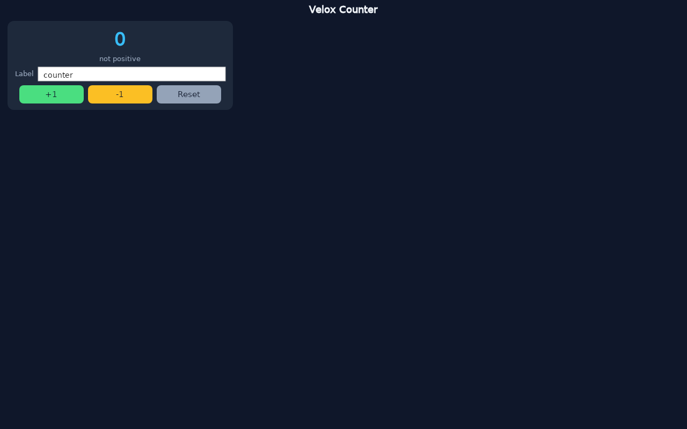

# Dev Workflow & HMR

`velox dev` is the inner loop of working with Velox: it watches your files, rebuilds on save, relaunches the app, and keeps a hot-reload channel open so the running app can be told to restart itself. This page is the complete reference — the watch loop, how a save is classified, what updates live versus what restarts, the keyboard shortcuts, and what to do when the OS watch budget runs out.



---

## The dev loop

```bash
velox dev                # watch the current directory
velox dev -w path/to/app # watch a specific project root
velox dev --release      # rebuild and relaunch in release mode
```

There is no positional directory argument — the watch root is passed with `--watch`/`-w` and defaults to `.`.

When the server starts it names every directory it watches. A scaffolded project gets **two roots**: `src/` and `assets/` — replacing an image an `` points at is exactly as much a rebuild as editing a `.vx` file, and watching `src/` alone made that edit silently do nothing. A project without `assets/` still starts; a root that does not exist is skipped rather than reported.

Watching is backed by the OS — inotify on Linux — not by polling, so a save is picked up in milliseconds. `target/`, `.git`, `.vscode`, `.idea`, and every dot-directory are excluded at any depth: `cargo build` writes thousands of files into `target/`, and watching it is what exhausts the kernel's watch budget.

Every event flows through the same pipeline:

```text
inotify event ──▶ exclude (target/, dot-dirs) ──▶ classify (which SFC block?)
      ──▶ 50 ms debounce window (burst coalescing) ──▶ rebuild ──▶ relaunch
```

---

## Save → classify → rebuild

The watcher does not just report *that* something changed — it classifies *which SFC block* the change landed in, exactly as Vite does. Both the previous and current source are parsed with the `velox-sfc` parser and their block contents diffed, so an unterminated `</templ` typed mid-keystroke is detected as broken rather than mistaken for a style-only edit.

| Kind | When | Response |
|:---|:---|:---|
| `StyleOnly` | Only `<style>` content differs | Routed to a stylesheet swap (see below) |
| `TemplateOnly` | Only `<template>` content differs | Full `cargo build` + relaunch |
| `Script` | Script logic changed, more than one block, the file does not parse as an SFC, or it is not an SFC at all | Full `cargo build` + relaunch |

Every ambiguity resolves to the conservative `Script` kind. The bias is deliberate and one-directional: mis-classifying an edit as cheaper would swap a stylesheet while the template that renders it never recompiled — stale code that *looks* live. Over-reporting costs a rebuild the user would have got anyway.

A single editor save produces several raw events (`create`, `modify`, `close_write`), so events land in a **50 ms debounce window**. The window is a deadline, not a sleep: the dev loop blocks on its command channel for exactly the remaining time, so a keystroke or a finished build still wakes it early. Several edits in one window are folded with the rule `Script > TemplateOnly > StyleOnly` — the merge can never make a build cheaper than any single edit in it.

While a build is running, further saves are *recorded* rather than acted on, and become one follow-up build when the current compile ends — N saves inside one compile cost one rebuild, not N competing `cargo build` processes.

The build itself runs on a worker thread, so the loop keeps servicing keystrokes, app exits, and further saves while the compiler works. `q` works during a cold compile too.

---

## What updates live vs what restarts

The honest answer today:

| Change | What happens |
|:---|:---|
| `<style>` block edit | Classified `StyleOnly`, routed to a stylesheet swap — but **all kinds rebuild today** |
| `<template>` edit | Full rebuild + relaunch |
| `<script>` edit | Full rebuild + relaunch |
| Asset in `assets/` | Full rebuild + relaunch |
| New file, deleted file, unparseable file | Full rebuild + relaunch |

> Note: every classified change rebuilds today — the style-swap path needs an `HmrMessage::StyleUpdate` message that does not exist yet, and flipping the switch before it exists would silently break CSS edits (nothing would rebuild *and* nothing would replace them). The classification is complete and tested now, so the live-CSS win lands as a one-line change when the message arrives.

What the dev server never does: stop on a compile error. A failed build prints its diagnostics and the watcher stays alive — the next save retries.

---

## The HMR channel

On startup the dev server binds a TCP listener on `127.0.0.1:31313` (`velox_renderer::DEFAULT_HMR_PORT`) **before** the banner is drawn, so every line the user reads is a statement about the run they are in. The app is spawned with `VELOX_HMR=1` and `VELOX_HMR_PORT=31313` — but only when the listener is really listening; with no listener the app gets `VELOX_HMR=0` so it never connects to a stranger holding the port.

On a rebuild the dev server sends a `FullReload` message (newline-delimited JSON) over that channel. The app's HMR client receives it and exits with code 0; the dev server then reaps the old process, compiles, and relaunches with a fresh build:

```text
save ──▶ classify ──▶ debounce ──▶ [velox] Sent FullReload to app
     ──▶ app exits (code 0) ──▶ ⏳ Compiling... ──▶ ✓ Compiled in 0.8s ──▶ App started (HMR enabled)
```

The port is fixed — there is no `--hmr-port` flag yet — so a stray listener squatting on 31313 wedges hot reload for this project until it is found and killed. The banner tells you when that has happened; see below.


---

## Banner and output

```text

  ⚡ Velox dev server  v0.1.1
  ➤ Project: counter
  ➤ Watching: /home/you/counter/src
  ➤ Watching: /home/you/counter/assets
  ➤ HMR: port 31313 (auto-reload on save)
  ➤ Build: debug

    r: reload   c: clear   q: quit

```

One `➤ Watching:` line is printed per root. The HMR line never advertises auto-reload it cannot deliver: when the bind fails it reads `port 31313 (unavailable: port 31313 in use by another process)`, and the started-app line correspondingly says `App started (HMR unavailable: …)`.

Other lines you will see:

| Line | When |
|:---|:---|
| `⏳ Compiling...` | On start and before every rebuild |
| `✓ Compiled in 0.8s` | A successful build |
| `App started (HMR enabled)` | The app process was spawned |
| `↻ src/App.vx changed (Script) — rebuilding` | A debounced save triggered a rebuild (the kind is the classification) |
| `↻ Manual reload requested` | You pressed `r` |
| `App exited. Press 'r' to restart, or save a file to rebuild.` | The app exited on its own |
| `✗ App crashed. Fix the error and save to rebuild.` | Pressing `c` while the app is down |
| `✗ Build failed` panel | A compile error — up to 20 `error[...]`/`error:`/`cannot find`/`expected` lines, with `Edit the file and save to rebuild.` underneath |
| `👋 Dev server stopped.` | You pressed `q`, or stdin closed |

The build-failure panel is deliberately not fatal and not the whole log: it filters the compiler's stderr to the diagnostic lines (falling back to the last 15 lines when no error line matches), so the fix is visible without scrolling.

---

## Keyboard shortcuts

| Key | Action |
|:---|:---|
| `r` (or `reload`) | Rebuild and restart the app by hand |
| `c` (or `clear`) | Clear the screen and redraw the banner |
| `q` (or `quit`, `exit`) | Stop the dev server and kill the running app |

The app is killed before the goodbye is printed, and closing stdin (e.g. running the server behind a pipe that ends) stops the server too.

---

## inotify troubleshooting

On Linux, watching is backed by inotify — a **finite kernel resource**. If the limit is exhausted, `watcher.watch()` fails with `No space left on device`, the dev server reports the error and **keeps running**, but files may no longer be detected. The failure is never fatal: a blind watcher is still a running dev server you can rebuild from by hand.

```bash
sudo sysctl -w fs.inotify.max_user_watches=524288
sudo sysctl -w fs.inotify.max_user_instances=1024
```

To persist the limit across reboots, write those two lines to a file in `/etc/sysctl.d/` (for example `/etc/sysctl.d/90-velox.conf`) and run `sudo sysctl --system`.

> Tip: if you suspect a dead watcher, press `r` — a manual rebuild works whether or not watching is alive. Then check that `target/` is outside the watched tree: the dev server excludes it itself, but a second watcher you started (another tool, another `velox dev`) may not.

> Tip: run `velox dev` from the project root. The watch roots are resolved relative to it (`src/`, `assets/`), and the banner names exactly what is being watched — if a directory you expect is missing from the banner, it does not exist on disk.

---

## See also

- [Renderer](renderer.md) — the HMR channel protocol and what `FullReload` does on the app side.
- [CLI Reference](cli.md) — every command and flag, including `velox dev`.
- [Template Syntax](template-syntax.md) — the blocks the classifier inspects.
