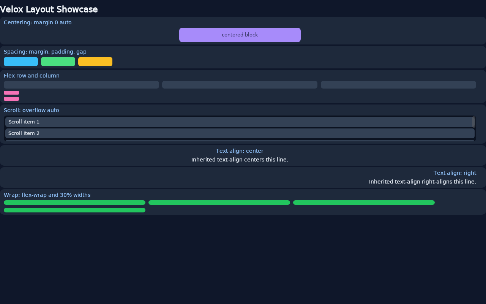

# Tutorial: The Layout Showcase

The [counter](counter.md) and the [todo app](todo.md) teach state and components. The showcase teaches layout — no state, no events, one static page that exercises the layout engine's features one section at a time.

It is also the smallest complete Velox app: a single `.vx` file whose `State` is a unit struct with one method. If you want to see what the framework does before writing any, this is the tour.

---

## Run it first

The showcase lives in the Velox repository:

```bash
git clone https://github.com/fahimaloy/velox
cd velox
cargo run -p velox-example-showcase --bin showcase
```

Or watch it with the dev server, from the example's directory:

```bash
cd examples/showcase
velox dev
```



---

## One component, seven sections

`examples/showcase/src/App.vx` is three blocks in one file. The template declares seven `<section>` elements; the script is nothing but a title:

```rust
<script setup>
pub struct State;

impl State {
    pub fn new() -> Self {
        Self
    }

    pub fn title(&self) -> String {
        String::from("Velox Layout Showcase")
    }
}
</script>
```

A component with no state, no events, and no slots still renders — layout is pure CSS over the tree your template declares.

| Section | Demonstrates |
| --- | --- |
| Centering | `margin: 0 auto` on a fixed-width block |
| Spacing | Per-item `padding`, `margin`, and the flex `gap` |
| Flex row and column | `flex-direction: row` / `column`, `flex: 1` |
| Scroll | `overflow: auto` on a fixed-height box |
| Text align | Inherited `text-align` — center and right |
| Wrap | `flex-wrap: wrap` with percentage widths |

Each section's rule is a few lines. Here is what each one teaches.

---

## Centering: `margin: 0 auto`

```css
.centered {
    display: block;
    width: 320px;
    margin: 0 auto;
    padding: 10px;
    border-radius: 8px;
    background: #a78bfa;
    color: #0f172a;
    text-align: center;
    font-weight: 600;
    font-size: 13px;
}
```

A fixed width plus `margin: 0 auto` centers the block in its section. This is the same pattern the counter's card uses — the one reliable way to center a block in Velox layout.

---

## Spacing: `margin`, `padding`, `gap`

```css
.spacing-row {
    display: flex;
    flex-direction: row;
    align-items: flex-start;
    gap: 8px;
}
.box-a { width: 90px; height: 24px; padding: 12px; background: #38bdf8; }
.box-b { width: 90px; height: 24px; padding: 20px; background: #4ade80; }
.box-c { width: 90px; height: 24px; padding: 12px; margin: 8px; background: #fbbf24; }
```

Three boxes, three spacing mechanisms: box B has deeper `padding`, box C carries an outer `margin`, and all three are separated by the flex `gap`. The section exists so you can see each of the three at work on the same row.

---

## Flex row and column

```css
.flex-row {
    display: flex;
    flex-direction: row;
    gap: 8px;
    margin-bottom: 6px;
}
.cell { flex: 1; height: 20px; }

.flex-col {
    display: flex;
    flex-direction: column;
    gap: 6px;
}
.dot { width: 40px; height: 10px; }
```

`flex: 1` makes the three cells share the row equally; the column stacks two dots with a gap between them. Row and column are the two axes every Velox layout is built from.

---

## Scroll: `overflow: auto`

```css
.scroll-box {
    height: 68px;
    overflow: auto;
    padding: 4px;
    border-radius: 8px;
    background: #0b1220;
}
.scroll-item {
    padding: 4px 8px;
    margin-bottom: 4px;
    border-radius: 6px;
    background: #334155;
    font-size: 13px;
}
```

A fixed height plus `overflow: auto` turns the box into a scroll area — five items in a 68px box scroll instead of overflowing. The todo app's list uses the same shape, which is why long lists scroll there.

---

## Text align: inheritance

```css
.section-center { text-align: center; }
.section-right { text-align: right; }
.line {
    display: block;
    margin: 0;
    font-size: 14px;
}
```

`text-align` and `font-family` are inherited: the section sets the alignment and the paragraph only sets its own size. The same inheritance is why the counter names its font once on `.app` and no child rule repeats it.

---

## Wrap: `flex-wrap` and percentage widths

```css
.wrap-row {
    display: flex;
    flex-wrap: wrap;
    gap: 8px;
}
.wrap-cell {
    width: 30%;
    height: 12px;
}
```

Percentage widths plus `flex-wrap` flow the cells onto a second row — four 30% cells cannot fit one row, so the fourth wraps. Without `flex-wrap`, they would shrink instead.

---

## Experiments

1. **Change the gap.** Set `.spacing-row` `gap: 8px` to `16px` and save — the hot-reload loop shows it immediately.
2. **Add a section.** Copy the centering `<section>` and give `.centered` a different width; watch `margin: 0 auto` re-center it.
3. **Break the wrap.** Remove `flex-wrap: wrap` from `.wrap-row` and see the four cells shrink instead of flowing.

---

## Where to go next

- [Styling](../features/styling.md) — the full property surface and the scoped-CSS contract
- [Template Syntax](../features/template-syntax.md) — every directive the SFC parser understands
- [Renderer](../features/renderer.md) — how the tree is laid out and drawn
- [Dev Workflow & HMR](../features/hmr-dev-workflow.md) — the loop behind `velox dev`
