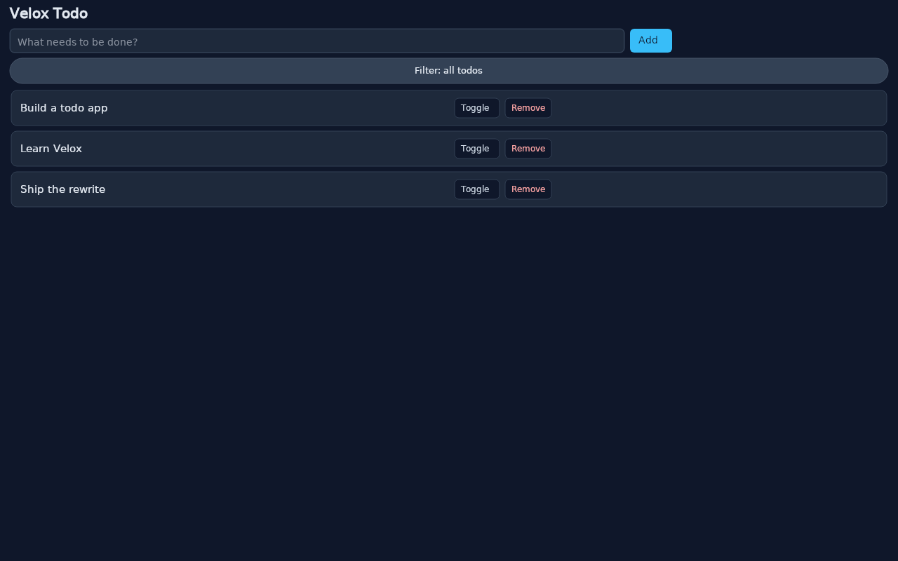

# Tutorial: Build a Todo App

The [counter](counter.md) tutorial taught you one component with its own state. A real app is several components that share it. This tutorial builds the todo app — an input, a filterable list, and the state that connects them.

Beyond the counter, you will use:

- **Components** — separate `.vx` files imported into a parent
- **Props** — parent-to-child data passing
- **Computed state** — a derived signal that re-filters when its inputs change
- **Events with payloads** — list rows that tell the parent which row was clicked

> Prerequisite: the [counter tutorial](counter.md). This one starts from the same skeleton.

---

## Step 1 — Project setup

Follow [Step 1](counter.md#step-1--create-the-project) of the counter tutorial: same `Cargo.toml`, same `build.rs`, and the same entry point with the window title changed to `"Velox Todo"`.

Then create the component directory:

```bash
mkdir -p src/components
```

The app is three `.vx` files:

```text
src/
├── main.rs
├── App.vx
└── components/
    ├── TodoInput.vx
    └── TodoItem.vx
```

| File | Role |
| --- | --- |
| `src/App.vx` | Parent: composition, the filter button, and event delegation |
| `src/components/TodoInput.vx` | The text field |
| `src/components/TodoItem.vx` | The row — and the model behind the whole list |

---

## Step 2 — The data model

`TodoItem.vx` looks like a single row, but it owns the data model for the entire list. Its script block starts with the types:

```rust
<script setup>
use velox_core::signal::Signal;

#[derive(Clone, Copy, PartialEq)]
pub enum Filter {
    All,
    Active,
    Completed,
}

#[derive(Clone, PartialEq)]
pub struct Todo {
    pub id: usize,
    pub text: String,
    pub completed: bool,
}

pub struct Props {
    pub todo: String,
    pub completed: bool,
    pub index: String,
}

pub struct State {
    pub props: Props,
    pub todos: std::rc::Rc<Signal<Vec<Todo>>>,
    pub filter: std::rc::Rc<Signal<Filter>>,
    pub next_id: std::rc::Rc<Signal<usize>>,
    pub visible: std::rc::Rc<Signal<Vec<Todo>>>,
}
</script>
```

Note the shape of `State`:

- `todos`, `filter`, `next_id` are the raw state — each an `Rc<Signal<T>>` from the `signal!` macro.
- `props` is what the parent passes down for this particular row.
- `visible` is the **derived** list — the next section.
- `Todo.id` is a stable identity, separate from any list position. That distinction carries the whole event story later.

---

## Step 3 — Computed state: the visible list

The filter is a `computed` — a signal whose value is derived from other signals:

```rust
let todos = velox_core::signal!(todos = vec![
    Todo { id: 0, text: String::from("Build a todo app"), completed: false },
    Todo { id: 1, text: String::from("Learn Velox"), completed: true },
]);
let filter = velox_core::signal!(filter = Filter::All);
let next_id = velox_core::signal!(next_id = 2usize);
let visible = {
    let todos = std::rc::Rc::clone(&todos);
    let filter = std::rc::Rc::clone(&filter);
    velox_core::signal::computed(move || {
        let list = todos.get();
        match filter.get() {
            Filter::All => list,
            Filter::Active => list
                .into_iter()
                .filter(|todo| !todo.completed)
                .collect(),
            Filter::Completed => list
                .into_iter()
                .filter(|todo| todo.completed)
                .collect(),
        }
    })
};
```

`signal::computed` takes a closure and re-runs it whenever any signal the closure reads changes. Read `todos`, read `filter` — that is the whole wiring. Tick a todo or cycle the filter and `visible` re-derives; nothing else has to know.

The same state also derives the filter label and the empty message, so both stay in sync with the list for free:

```rust
pub fn filter_label(&self) -> String {
    match self.filter.get() {
        Filter::All => String::from("Filter: all todos"),
        Filter::Active => String::from("Filter: active todos"),
        Filter::Completed => String::from("Filter: completed todos"),
    }
}

pub fn empty_message(&self) -> String {
    if !self.visible.get().is_empty() {
        return String::new();
    }
    match self.filter.get() {
        Filter::All => String::from("Nothing to do yet. Add a todo above."),
        Filter::Active => String::from("No active todos. Nice work!"),
        Filter::Completed => String::from("No completed todos yet."),
    }
}
```

---

## Step 4 — Mutations: add, toggle, remove

All three mutations go through `todos.update(f)`, which applies a closure to the current vector and writes the result back:

```rust
pub fn add_todo(&self, text: &str) {
    let id = self.next_id.get();
    self.next_id.set(id + 1);
    self.todos.update(|mut todos| {
        todos.push(Todo { id, text: text.to_string(), completed: false });
        todos
    });
}

pub fn on_toggle(&self, payload: &str) {
    if let Ok(visible_index) = payload.trim().parse::<usize>() {
        let visible = self.visible.get();
        if let Some(target) = visible.get(visible_index) {
            let id = target.id;
            self.todos.update(|mut todos| {
                if let Some(todo) = todos.iter_mut().find(|todo| todo.id == id) {
                    todo.completed = !todo.completed;
                }
                todos
            });
        }
    }
}

pub fn on_remove(&self, payload: &str) {
    if let Ok(visible_index) = payload.trim().parse::<usize>() {
        let visible = self.visible.get();
        if let Some(target) = visible.get(visible_index) {
            let id = target.id;
            self.todos.update(|mut todos| {
                todos.retain(|todo| todo.id != id);
                todos
            });
        }
    }
}
```

The two-step lookup in `on_toggle` and `on_remove` is the important pattern. The payload names a position in the **visible** list — but the filter re-orders that list, so positions are not identities. The handler maps the visible index to the stable `Todo.id` first, then mutates the full `todos` list by that id.

Filtering cycles through the three states:

```rust
pub fn cycle_filter(&self) {
    let next = match self.filter.get() {
        Filter::All => Filter::Active,
        Filter::Active => Filter::Completed,
        Filter::Completed => Filter::All,
    };
    self.filter.set(next);
}
```

---

## Step 5 — The row template and events

```html
<template>
  <div class="todo-item"><p class="text" :class="{ done: completed }">{{ todo }}</p><button class="btn" @click="on_toggle" :click-payload="index">Toggle</button><button class="btn remove" @click="on_remove" :click-payload="index">Remove</button></div>
</template>
```

Three details to notice:

- **`:class="{ done: completed }"`** — the object binding adds the `done` class when the prop is truthy, which is what strikes completed rows green.
- **`:click-payload="index"`** — the click carries the row's index with it. That is the string `on_toggle` and `on_remove` parse in the previous section.
- The buttons reference `on_toggle` / `on_remove`, which the **parent's** template binds on the `<TodoItem>` tag — not this file.

---

## Step 6 — The input component

`src/components/TodoInput.vx` is a plain text field with its own draft state:

```html
<template>
  <div class="todo-input"><input type="text" class="input" :value="value" :placeholder="placeholder" @input="on_input" /></div>
</template>

<script setup>
use velox_core::signal::Signal;

pub struct Props {
    pub value: String,
    pub placeholder: String,
}

pub struct State {
    pub props: Props,
    pub draft: std::rc::Rc<Signal<String>>,
}

impl State {
    pub fn new() -> Self {
        Self {
            props: Props {
                value: String::new(),
                placeholder: String::from("What needs to be done?"),
            },
            draft: velox_core::signal!(draft = String::new()),
        }
    }

    pub fn value(&self) -> String {
        self.props.value.clone()
    }

    pub fn placeholder(&self) -> String {
        self.props.placeholder.clone()
    }

    pub fn draft(&self) -> String {
        self.draft.get()
    }

    pub fn clear(&self) {
        self.draft.set(String::new());
    }

    pub fn on_input(&self, payload: &str) {
        self.draft.set(payload.to_string());
    }
}
</script>
```

`on_input` receives the input's payload — the current text — and stores it in `draft`. `clear` empties it; the parent calls it after a successful add.

---

## Step 7 — The parent: composition and delegation

`src/App.vx` imports both components at the top of its script block:

```rust
import TodoInput from './components/TodoInput.vx'
import TodoItem from './components/TodoItem.vx'

use velox_core::signal::Signal;
```

and holds their persistent states as fields:

```rust
pub struct State {
    // The parent owns event handlers and delegates them to these persistent
    // component states, so component inputs and actions are not inert.
    pub todoinput: std::sync::Arc<super::todoinput::script_rs::State>,
    pub todoitem: std::sync::Arc<super::todoitem::script_rs::State>,
    pub visible: std::rc::Rc<Signal<Vec<super::todoitem::script_rs::Todo>>>,
}

impl State {
    pub fn new() -> Self {
        let todoinput = std::sync::Arc::new(super::todoinput::script_rs::State::new());
        let todoitem = std::sync::Arc::new(super::todoitem::script_rs::State::new());
        let visible = todoitem.visible_signal();
        Self { todoinput, todoitem, visible }
    }

    pub fn draft(&self) -> String {
        self.todoinput.draft()
    }

    pub fn add_todo(&self) {
        let text = self.draft().trim().to_string();
        if text.is_empty() {
            return;
        }
        self.todoitem.add_todo(&text);
        self.todoinput.clear();
    }

    pub fn on_input(&self, payload: &str) {
        self.todoinput.on_input(payload)
    }

    pub fn on_toggle(&self, payload: &str) {
        self.todoitem.on_toggle(payload)
    }

    pub fn on_remove(&self, payload: &str) {
        self.todoitem.on_remove(payload)
    }

    pub fn cycle_filter(&self) {
        self.todoitem.cycle_filter()
    }

    pub fn filter_label(&self) -> String {
        self.todoitem.filter_label()
    }

    pub fn empty_message(&self) -> String {
        self.todoitem.empty_message()
    }
}
```

The composition model, in one paragraph: each `.vx` file becomes a Rust module named after its file stem — `src/components/TodoInput.vx` generates module `todoinput`, whose state lives at `todoinput::script_rs::State`. The parent constructs both child states up front, holds them, and exposes two things to its own template: read methods (`draft`, `filter_label`, `empty_message`) and the event handlers the template binds. The parent's handlers are one-line delegations — the state and the logic stay in the component that owns them.

> Note: `visible` is the child's **computed** signal, shared out through `visible_signal()`. The parent holds the same `Rc`, so the `v-for` in its template iterates the live, filtered list.

The parent's template ties it together:

```html
<template>
  <div class="app">
    <h1 class="title">{{ title }}</h1>
    <div class="entry">
      <TodoInput
        :value="draft"
        :placeholder="input_placeholder"
        @input="on_input"
      />
      <button class="add" @click="add_todo">Add</button>
    </div>
    <button class="filter" @click="cycle_filter">{{ filter_label }}</button>
    <div class="list">
      <TodoItem
        v-for="(todo, idx) in visible"
        :key="todo.id"
        :todo="todo.text"
        :completed="todo.completed"
        :index="idx"
        @toggle="on_toggle"
        @remove="on_remove"
      />
      <p class="empty" v-if="empty_message">{{ empty_message }}</p>
    </div>
  </div>
</template>
```

---

## Step 8 — List rendering

The `<TodoItem>` tag is the list:

- **`v-for="(todo, idx) in visible"`** — iterates the computed signal, binding the item and its position.
- **`:key="todo.id"`** — the stable identity from the data model, not the list position.
- **`:todo="todo.text"`, `:completed="todo.completed"`, `:index="idx"`** — the props that become `Props` in the child.
- **`@toggle="on_toggle"`, `@remove="on_remove"`** — the events the child's buttons raise, handled here in the parent and delegated onward.

The empty state is one line: `<p class="empty" v-if="empty_message">{{ empty_message }}</p>`. `empty_message` returns an empty string while the visible list has rows — and an empty string is falsy, so the paragraph only renders when it has something to say.

---

## Step 9 — Run it

```bash
veloxc dev
```

Add a todo, tick a row, cycle the filter, remove a row — every action routes from a click through the parent's handler into the child's state, and the list re-derives.



---

## Exercises

1. **Show the count.** Add a `summary()` method to the parent that returns `"3 left of 5"` from `todoitem`, and render it with `{{ summary }}`.
2. **Add a fourth filter.** Extend the `Filter` enum and `cycle_filter` — then update `filter_label` and `empty_message` to cover it.
3. **Edit in place.** Give `TodoItem` an `on_edit` event and let a double-click replace the text with an input.
4. **Persist the list.** Serialize `todos` with `serde_json` on exit and load it in `State::new()`.

For the full event surface — payloads, dispatch, and ownership rules — see [Events](../features/events.md), and for every template directive, [Template Syntax](../features/template-syntax.md).
