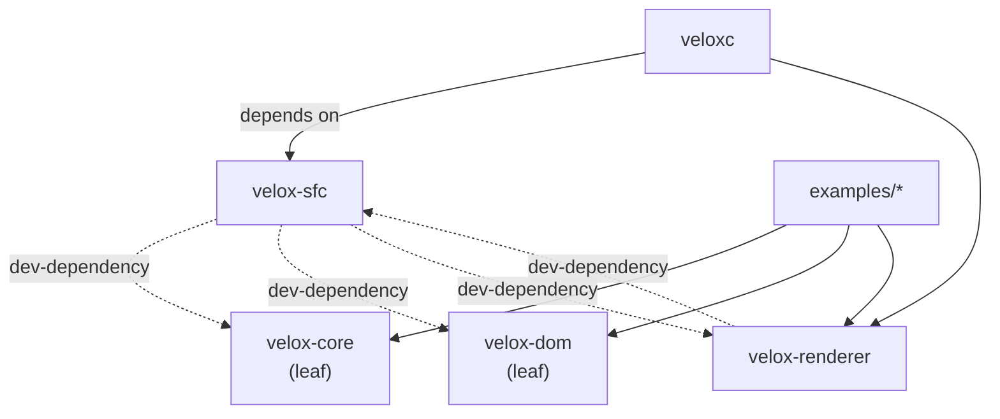

# velox-sfc

Single-file component compiler for the Velox UI framework.

[](https://crates.io/crates/velox-sfc) [](https://crates.io/crates/velox-sfc) [](https://crates.io/crates/velox-sfc) [](https://docs.rs/velox-sfc)

## Overview

`velox-sfc` turns a `.vx` single-file component — `<template>`, `<script setup>`, `<script>`, `<style>` — into Rust source: it splits the blocks, parses the template into an AST, resolves component imports, and emits the render function, event dispatcher, `v-model` setters and scoped CSS that the generated `State` runs on. It is a pure parser/compiler crate: its only dependencies are `pest` and `pest_derive`, so it can run inside a build script without dragging in the rest of the framework. The `veloxc` CLI drives it, and its own tests — which execute the generated code — are what pull `velox-core`, `velox-dom` and `velox-renderer` in as dev-dependencies.

## Installation

```bash
cargo add velox-sfc
```

No feature flags. Runtime dependencies: `pest 2.8` and `pest_derive 2.8` only — the crate's normal dependency surface is a pure parser.

## API reference

Signatures below are copied from the source; see [docs.rs/velox-sfc](https://docs.rs/velox-sfc) for the full list.

### Splitting an SFC

| Signature | Description |
|---|---|
| `pub fn parse_sfc(source: &str) -> Result<Sfc, String>` | Split a `.vx` file into its blocks with `pest` (grammar `grammar.pest`); errors come back caret-style. Non-fatal template diagnostics are collected into `Sfc::warnings`, never printed. |
| `pub fn validate_sfc(sfc: &Sfc) -> Vec<String>` | Structural validation of a parsed file; one message per problem. |
| `pub struct Sfc { pub template: Option<TemplateBlock>, pub script_setup: Option<ScriptBlock>, pub script: Option<ScriptBlock>, pub style: Option<StyleBlock>, pub warnings: Vec<String> }` | The four block slots plus accumulated warnings. |
| `pub struct TemplateBlock { pub attrs: Vec<Attr>, pub content: String }` | The `<template>` body and its attributes (e.g. `id="root"`). |
| `pub struct ScriptBlock { pub attrs: Vec<Attr>, pub content: String, pub setup: bool }` | A `<script>` or `<script setup>` block; `setup` distinguishes them. |
| `pub struct StyleBlock { pub attrs: Vec<Attr>, pub content: String }` | The `<style>` block (attributes carry `scoped`). |
| `pub struct Attr { pub name: String, pub value: Option<String> }` | A block-level attribute; `value` is `None` for bare flags like `scoped`. |
| `pub const MAX_NESTED_TEMPLATE_DEPTH: usize = 256;` | Nesting ceiling for templates inside an SFC. |

### Parsing a template

| Signature | Description |
|---|---|
| `pub fn parse_template_to_ast(input: &str) -> Result<Vec<Node>, String>` | Iterative HTML-ish parser (nesting, self-closing tags, `:bind`, `@event`, `{{ interpolation }}`). Warnings are printed to stderr, preserving this entry point's historical behaviour. |
| `pub fn parse_template(input: &str, known_components: &[&str]) -> Result<TemplateDiag, String>` | Same parser, warnings returned instead of printed, plus `unknown component` diagnostics for PascalCase tags missing from `known_components`. |
| `pub struct TemplateDiag { pub nodes: Vec<Node>, pub warnings: Vec<String> }` | Parsed AST alongside its non-fatal warnings. |
| `pub enum Node { Element { tag: String, attrs: Vec<TemplateAttr>, children: Vec<Node>, self_closing: bool }, Text(String), Interpolation(String) }` | The template AST. |
| `pub struct TemplateAttr { pub name: String, pub value: Option<String>, pub kind: AttrKind }` | One attribute, classified. |
| `pub enum AttrKind { Static, Bind, On, Directive }` | `class="x"` / `:value="e"` / `@click="e"` / `v-if`, `v-for`, …. |
| `pub const MAX_TEMPLATE_DEPTH: usize = 256;` | Hard ceiling on element nesting depth, in unclosed elements. |

### Compiling to Rust

| Signature | Description |
|---|---|
| `pub fn compile_template_to_rs(template_src: &str, component_name: &str, resolver: Option<&mut ComponentResolver>) -> Result<String, String>` | Compile a `<template>` into a Rust module body with `render()` — the convenience entry point. |
| `pub fn compile_template_to_rs_full(template_src: &str, component_name: &str, resolver: Option<&mut ComponentResolver>, script_setup: Option<&str>, scope_id: Option<&str>) -> Result<String, String>` | The full form: indexes `script_setup` so template keys resolve to real `State` method names, and threads `scope_id` (e.g. `"data-v-abc123"`) onto every element for scoped CSS. |
| `pub fn compile_template_to_rs_full_with_mode(template_src: &str, _component_name: &str, resolver: Option<&mut ComponentResolver>, script_setup: Option<&str>, scope_id: Option<&str>, mode: RenderMode) -> Result<String, String>` | Adds the render mode. Generated code is identical in both modes — only diagnostics differ. |
| `pub enum RenderMode { #[default] State, Resolve }` | `State` renders through `render_with_state` (reads `Signal`/`Ref` and loop items from the persistent `State` — what `veloxc` uses); `Resolve` renders through `render_with`/`render_with_props` and reports loop-rooted bindings it cannot resolve. |
| `pub fn collect_vmodel_expressions(nodes: &[Node]) -> Vec<(String, String)>` | All `v-model`s in a template; for `v-model="counter"` returns `("counter", "__vmodel_set_counter")`. |
| `pub fn generate_vmodel_setters(vmodels: &[(String, String)]) -> String` | Emit `pub fn __vmodel_set_*(…)` setters that call `velox_core::vmodel::VModel::vmodel_set`. |
| `pub fn lint_script(script: &str) -> Vec<String>` | Warn about `Cell`/`RefCell` state that will not trigger a redraw (path: `velox_sfc::lint_script`). |

### Stubs and scoped CSS — `velox_sfc::codegen`

| Signature | Description |
|---|---|
| `pub fn to_stub_rs(sfc: &Sfc, component_name: &str) -> String` | Emit the stub `.rs` for a component. |
| `pub fn to_stub_rs_with_base(sfc: &Sfc, component_name: &str, base_path: Option<&Path>) -> String` | Same, with a base path for module resolution. |
| `pub fn to_stub_rs_unwrapped(sfc: &Sfc, component_name: &str, base_path: Option<&Path>) -> String` | Same, without the wrapping module. |
| `pub fn is_scoped(style: &StyleBlock) -> bool` | Whether the `<style>` block carries the `scoped` attribute. |
| `pub fn generate_scope_id(component_name: &str) -> String` | Deterministic scope id for a component, e.g. `"data-v-…"`. |
| `pub fn scope_css(css: &str, scope_id: &str) -> String` | Rewrite selectors so they only match within their component's scope attribute. |
| `pub fn generate_props_arg(ss: &str, indent: &str) -> String` | Build the props argument from the `<script setup>` source. |

### Components and diagnostics

| Signature | Description |
|---|---|
| `pub struct ComponentResolver` | Import-aware resolver: `new(base_path: impl Into<PathBuf>)`, `parse_imports(&mut self, script_content: &str)`, `is_component(&self, tag: &str) -> bool`, `get_import(&self, name: &str) -> Option<&ComponentImport>`, `load_component(&mut self, name: &str) -> Result<&Sfc, String>`, `component_names(&self) -> Vec<String>`, `resolve_path(&self, source: &str) -> PathBuf`. |
| `pub struct ComponentImport` | One resolved `<script setup>` import. |
| `pub fn transform_components(nodes: &mut [Node], resolver: &ComponentResolver)` | Rewrite known component tags in a template AST once they resolve. |
| `pub fn line_col_at(source: &str, byte_offset: usize) -> (usize, usize)` | Byte offset to a 1-based `(line, column)` pair (`velox_sfc::diagnostic`). |
| `pub fn render_parse_error(source: &str, line: usize, column: usize, width: usize, message: &str, suggestion: Option<&str>) -> String` | Caret-style error text with an optional `help:` line (`velox_sfc::diagnostic`). |

## Example

Straight from `velox-sfc/tests/integration_pipeline_tests.rs`:

```rust
use velox_sfc::{compile_template_to_rs, parse_sfc, to_stub_rs};

let src = r#"<template>
  <div>
    <button @click="inc">Inc</button>
    <span>{{ count }}</span>
  </div>
</template>
<script setup>
use std::cell::Cell;
pub struct State { pub count: Cell<i32> }
impl State {
    pub fn new() -> Self { Self { count: Cell::new(0) } }
    pub fn inc(&self) { self.count.set(self.count.get() + 1); }
}
</script>"#;

let sfc = parse_sfc(src).expect("parse ok");
assert!(sfc.template.is_some());
assert!(sfc.script_setup.is_some());

let template = sfc.template.as_ref().unwrap().content.as_str();
let render_fn = compile_template_to_rs(template, "Counter", None).expect("compiles");

// The generated body carries the event wiring and the render functions.
assert!(render_fn.contains("make_on_event"));
assert!(render_fn.contains("inc"));
assert!(render_fn.contains("render()"));

let stub = to_stub_rs(&sfc, "Counter");
println!("{stub}");
```

## How it relates



`velox-sfc` is the front of the pipeline: it needs nothing from the framework at runtime, only `pest`. `veloxc` invokes it to generate the crates the other libraries then consume, and `velox-renderer` keeps it as a dev-dependency for end-to-end compile tests.

## License

MIT
